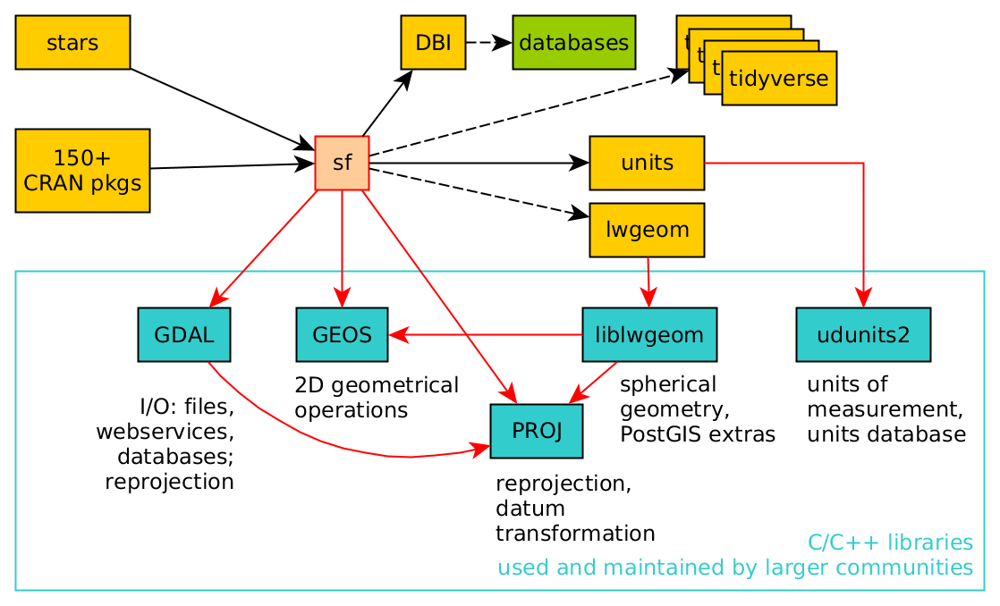

```{r knitr_init, echo=FALSE, cache=FALSE}
library(knitr)
options(max.print="90")
opts_chunk$set(echo=TRUE,
               cache=TRUE,
               prompt=FALSE,
               tidy=FALSE,
               comment=NA,
               message=FALSE,
               warning=FALSE, 
               fig.align='center')
opts_knit$set(width=80)
```


# Recherche reproductible


## Reproductibilité, réplicabilité

Selon Claerbout, Donoho, Peng (... et Giraud) : 

**Recherche reproductible** : Les auteurs fournissent les données et le code nécessaire pour rejouer les analyses et recréer les résultats numériques.

**Replication** : Une étude arrive aux même résultats scientifiques en collectant de nouvelles données (éventuellement avec des méthodes différentes) et en réalisant une nouvelle analyse.  

</br>
**Attention**, d'autres auteurs et institutions inversent ces définitons, les utilisent de manière indifférenciée ou rajoute le concept de répétabilité.  

<font size="2">Barba, L. A. (2018). Terminologies for reproducible research. arXiv preprint [arXiv:1802.03311](https://arxiv.org/abs/1802.03311).</font>


## Le spectre de la reproductibilité


<font size="2">Peng R. D. (2011). Reproducible research in computational science. *Science (New York, N.Y.), 334*(6060), 1226–1227. https://doi.org/10.1126/science.1213847</font>


# Panorama des solutions assurant la reproductibilité des analyses avec R


## La figure seule

```{r, fig.align='center', echo=FALSE}
knitr::include_graphics("img/map.png", dpi = 110)
```

## La figure avec les données

<div class="columns-2">


```{r, fig.align='center', echo=FALSE}
knitr::include_graphics("img/csv.png", dpi = 150)
```

```
.
├── data
│   ├── martinique.gpkg
│   └── rev.csv
└── fig
    └── map.png
```    


</div>

## La figure avec les données et les métadonnées
<div class="columns-2">


```{r, fig.align='center', echo=FALSE}
knitr::include_graphics("img/meta.png", dpi = 150)
```

```
.
├── data
│   ├── martinique.gpkg
│   └── rev.csv
├── fig
│   └── map.png
└── metadata
    └── metadata.txt
```    


## La figure, les données, les métadonnées et le script

<div class="columns-2">

```{r, fig.align='center', echo=FALSE}
knitr::include_graphics("img/script.png", dpi = 150)
```


```
.
├── analyse
│   └── carte_revenus.R
├── data
│   ├── martinique.gpkg
│   └── rev.csv
├── fig
│   └── map.png
└── metadata
    └── medata.txt

``` 


</div>


## La figure, les données, les métadonnées et le script

```{r, fig.align='center', echo=FALSE}
knitr::include_graphics("img/script.png", dpi = 96)
```


## Un projet RStudio


<div class="columns-2">

```{r, fig.align='center', echo=FALSE}
knitr::include_graphics("img/rstudio.png", dpi = 150)
```

```
.
├── analyse
│   └── carte_revenus.R
├── data
│   ├── martinique.gpkg
│   └── rev.csv
├── fig
│   └── map.png
└── make_a_map.Rproj
```

</div>

## Un projet RStudio


```{r, fig.align='center', echo=FALSE}
knitr::include_graphics("img/rstudio.png", dpi = 96)
```

## Un projet RStudio + litterate programming + sessionInfo()

<div class="columns-2">

```{r, fig.align='center', echo=FALSE}
knitr::include_graphics("img/rmd.png", dpi = 215)
```

```
.
├── analyse
│   ├── carte_des_revenus.Rmd
│   └── carte_des_revenus.html
├── data
│   ├── martinique.gpkg
│   └── rev.csv
├── fig
│   └── map.png
├── make_a_map.Rproj
└── metadata
    └── metadata.txt
```

## 


```{r, fig.align='center', echo=FALSE}
knitr::include_graphics("img/session.png", dpi = 120)
```

## 

## Un gestionnaire de package

* [`renv`](https://rstudio.github.io/renv/) (succésseur de `packrat`)
* [`miniCRAN`](http://andrie.github.io/miniCRAN/) : créer un CRAN personnel
* [`checkpoint`](https://github.com/RevolutionAnalytics/checkpoint/)
* [`groundhog`](https://cran.r-project.org/web/packages/groundhog/index.html)


## `renv` 

 


* Gerer les versions des packages utilisés dans un projet. 

* Isoler, intelligemment, les packages par projet.

## `renv` 

   
[Package renv : présentation et retour d’expérience, par Elise Maigné](https://r-toulouse.netlify.app/evenements/2021-05-28-diaporama-et-vid%C3%A9o-de-la-rencontre-de-mai-2021/)   
RUG Toulouse, mai 2021


## Make-like pipeline toolkit

  

`target` (succésseur de `drake`)  

* Pour les gros projets. 

* Gestion des caches et parralélisation des tâches


## `target` 

    
[Reproducible Computation at Scale in R with {targets}, par Will Landau](https://www.meetup.com/R-Lille/events/277902715)  
RUG Lille, le 17 juin 2021

[Tutoriel officiel, une demi journée](https://github.com/wlandau/targets-tutorial)

## "Packager" son analyse


1 - Les packages fournissent une structure de dossiers standardisée pour organiser les fichiers  
2 - Les packages fournissent des fonctionnalités pour documenter les données et les fonctions  
3 - Les packages fournissent un cadre pour tester son code  
4 - se concentrer sur les points 1–3 permet de réutiliser et partager son code

<font size="2">[Put your Data Analysis in an R Package — Even if You Don’t Publish it, par Denis Gontcharov](https://towardsdatascience.com/put-your-data-analysis-in-an-r-package-even-if-you-dont-publish-it-64f2bb8fd791)</font>


## Utiliser des containers

```{r, fig.align='center', echo=FALSE}

```

<font size="2">[Edzer Pebesma, Roger Bivand, Angela Li (helper). Spatial and Spatiotemporal Data Analysis in R. UseR! Workshop, Jul 9, 2019](https://github.com/edzer/UseR2019)</font>


## Docker

  

``` console
docker pull riatelab/make_a_map:v1.0.0

docker run -d -e PASSWORD=xxx --rm -p 8787:8787 riatelab/make_a_map:v1.0.0 
```


## Docker

  

* [An Introduction to Docker for R Users, par Colin Fay](https://colinfay.me/docker-r-reproducibility/)

* [An Introduction to Rocker: Docker Containers for R, par Carl Boettiger et Dirk Eddelbuettel](https://journal.r-project.org/archive/2017/RJ-2017-065/index.html)

* [Dockerizing your R analysis, par Phil Chapman](https://chapmandu2.github.io/post/2019/02/02/dockerizing-your-r-analysis/)


##

## Systèmes de gestion de version

git, GitHub, GitLab ???

- Git est un système de gestion de version distribué

    - tracker les changement dans les fichiers texte
    - gérer l'historique du code source
    - partager le code avec des dépots distantes
  
  
- GitHub et GitLab hébèrgent des dépots distants + des services pour gérer des projets (issue tracking, collaboration, hébergement web, CI/CD)


- GitLab a un modèle open-core. Possibilité d'héberger une instance. 


## Git 


<font size="2">Ram, K. Git can facilitate greater reproducibility and increased transparency in science. *Source Code Biol Med 8*, 7 (2013). https://doi.org/10.1186/1751-0473-8-7</font>


## Research Compendium


> *A research compendium accompanies, enhances, or is a scientific publication providing data, code, and documentation for reproducing a scientific workflow.*  
<font size="2">[https://research-compendium.science/](https://research-compendium.science/)</font>


* https://rcarto.gitpages.huma-num.fr/centralite/


## Les données

Stocker / archiver ses données dans un dépôt respectant les principes FAIR : 

    

 

## Et après? 


<font size="2">Peer, L., Orr, L., & Coppock, A. (2021). Active Maintenance: A Proposal for the Long-Term Computational Reproducibility of Scientific Results. *PS: Political Science & Politics*, 1-5. doi:10.1017/S1049096521000366</font>

## Quelques ressources


[CRAN Task View: Reproducible Research](https://cran.r-project.org/web/views/ReproducibleResearch.html)  

[Recherche reproductible : principes méthodologiques pour une science transparente](https://www.fun-mooc.fr/fr/cours/recherche-reproductible-principes-methodologiques-pour-une-science-transparente/) MOOC de C. Pouzat, A. Legrand et K. Hinsen  

[Vers une recherche reproductible](https://rr-france.github.io/bookrr/)


## Merci

  [rcarto.github.io/spectre-reproductibilite-r/](https://rcarto.github.io/spectre-reproductibilite-r/)    
</br>
  [Code de la présentation](https://github.com/rCarto/spectre-reproductibilite-r)  
</br>
  [\@rgeomatic](http://twitter.com/rgeomatic)  
</br>
  [rgeomatic.hypotheses.org](https://rgeomatic.hypotheses.org/)


## {.smaller}
```{r, echo = FALSE}
options(width="110")
x <- sessionInfo()
print(x, locale=FALSE, RNG = F)
```


