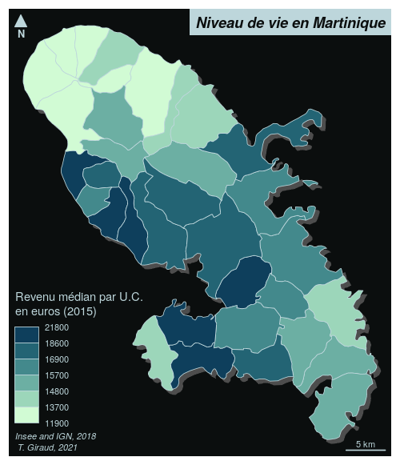

```{r, include = FALSE}
knitr::opts_chunk$set(
  collapse = TRUE,
  comment = "#>"
)
```

# Create a map


```{r, message = FALSE, results='hide'}
# libraries
library(mapsf)
# data import
revenus <- read.csv("../data/rev.csv")
mtq <- st_read("../data/martinique.gpkg")
# merge basemap and data
mtq <- merge(mtq, revenus, by = "INSEE_COM", all.x = TRUE)
# export map
mf_export(mtq, 
          filename = "../fig/map.png", 
          width = 500, res = 110, 
          theme = "iceberg")
# add a shadow
mf_shadow(mtq, col = "grey30", add = TRUE)
# plot choropleth map
mf_map(mtq, "MED", "choro", 
       pal = "Dark Mint",
       leg_pos = "bottomleft2", 
       leg_title = "Revenu médian par U.C.\nen euros (2015)", 
       add = TRUE, leg_val_rnd = -2)
# add title
mf_title("Niveau de vie en Martinique")
# add credits, scale bar and north arrow
mf_credits(txt = "Insee and IGN, 2018\n T. Giraud, 2021")
mf_scale(5)
mf_arrow()
dev.off()
```



# Metadata

-   A [GeoPackage](https://www.geopackage.org/) of Martinique municipalities.
    -   Sources: [Base comparateur de territoires](https://www.insee.fr/fr/statistiques/2521169) (upload date: 2018-09-25) & [ADMIN EXPRESS-COG](http://professionnels.ign.fr/adminexpress) (2018 edition).
    -   Citation: Insee and IGN, 2018
    -   Fields:
        -   **INSEE_COM**: Municipality identifier
        -   **STATUS**: Municipality administrative status
        -   **LIBGEO**: Municipality name
        -   **POP**: Total population, 2015
        -   **MED**: Median disposable income adjusted per equivalent household member, in euros, 2015
        -   **CHOM**: Unemployed population, 2015
        -   **ACT**: Active population, 2015


# Informations sur la session

```{r}
sessionInfo()

```

