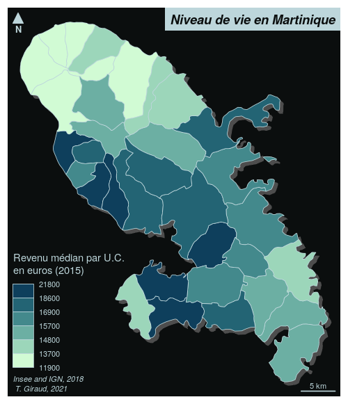

```{r, include = FALSE}
knitr::opts_chunk$set(
  collapse = TRUE,
  comment = "#>"
)
```


```{r}
library(mapsf)
revenus <- read.csv(system.file("csv/rev.csv", package = "mam"))
mtq <- st_read(system.file("gpkg/martinique.gpkg", package = "mam"), 
               quiet = TRUE)
mtq <- merge(mtq, revenus, by = "INSEE_COM", all.x = TRUE)
mf_export(mtq, 
          filename = "map.png", 
          width = 500, res = 110, 
          theme = "iceberg")
mf_shadow(mtq, col = "grey30", add = TRUE)
mf_map(mtq, "MED", "choro", 
       pal = "Dark Mint",
       leg_pos = "bottomleft2", 
       leg_title = "Revenu médian par U.C.\nen euros (2015)", 
       add = TRUE, leg_val_rnd = -2)
mf_title("Niveau de vie en Martinique")
mf_credits(txt = "Insee and IGN, 2018\n T. Giraud, 2021")
mf_scale(5)
mf_arrow()
dev.off()
```


